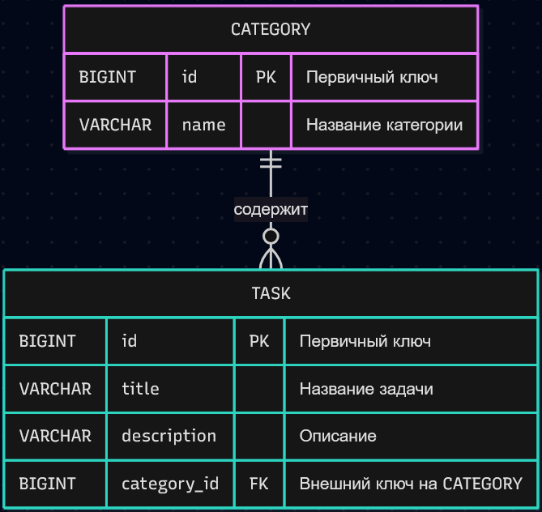

# Retake-KT3

Учебный проект на Spring Boot (Spring MVC + Spring Data JPA)

## О чём проект

Веб-приложение «Список задач» с CRUD-операциями, валидацией, категориями и хранением данных в базе H2.

## Что демонстрируется

- Spring MVC: Controller → Service → Repository
- Spring Data JPA + Hibernate для работы с БД
- База данных H2 (файловая)
- Связь `@ManyToOne` между задачами и категориями
- Валидация формы (`@Valid`, `@NotBlank`, `@Size`, `@NotNull`)
- Обработка ошибок (`@ExceptionHandler` + страницы `404.html` / `error.html`)
- Стилизация через Bootstrap 5 + тема Morph
- SQL-скрипты для создания таблиц и связей — в папке `sql/`

## ER-диаграмма

## Страницы

| URL | Описание |
|-----|----------|
| `/` | Главная |
| `/about` | О приложении |
| `/tasks` | Список задач |
| `/tasks/new` | Создание задачи |
| `/tasks/{id}/edit` | Редактирование |
| `/h2-console` | Веб-консоль базы данных |

## Настройка БД

H2 (файловая), настройки в `src/main/resources/application.properties`:

- JDBC URL: `jdbc:h2:file:~/retake-kt3-db`
- User: `laskez`
- Password: 

При первом запуске Hibernate создаёт таблицы по JPA-аннотациям на сущностях `Task` и `Category`.

### H2 Console

Для просмотра данных в браузере:

- **URL:** http://localhost:8080/h2-console
- **JDBC URL:** `jdbc:h2:file:~/retake-kt3-db`
- **User Name:** `laskez`
- **Password:**

Примеры запросов

- `SELECT * FROM TASK;`
- `SELECT * FROM CATEGORY`
## SQL-скрипты

В папке `sql/`:

- `01-create-database.sql` — создание БД
- `02-create-tables.sql` — таблицы и ключи
- `03-insert-data.sql` — начальные данные

## Запуск

Через IDE: запустить `RetakeKt3Application`.

Или через Maven:
`mvn spring-boot:run`

После запуска открыть: http://localhost:8080

## Стек

- Java 21
- Spring Boot 4.1.1
- Spring Data JPA
- Hibernate
- H2
- Thymeleaf
- Bootstrap 5 (Morph)
- Maven